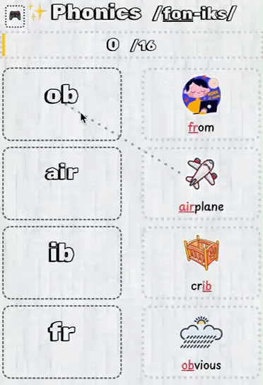

# 🎯 Phonics - Making English Pronunciation Simple and Fun

> An interactive phonics learning platform designed for parents and children

[](https://phonics.misuisui.com/)

## ✨ Why Choose Phonics?

As a parent teaching English to my kids, I found plenty of phonics books and videos, **but no simple website** where I could quickly look up pronunciation rules for specific letter combinations.

So I built one 🚀

## 📸 Quick Preview



## 🎮 Learn Through Interactive Play

### Interactive Learning
- 👀 Quickly browse pronunciation rules for any letter combination
- 🎵 Native speaker pronunciation with audio and visual reinforcement
- 📱 Responsive design - works on phones, tablets, and computers

### Fun Matching Game
Reinforce learning through an engaging card matching game:
- 🎴 Match sounds with their corresponding phonics rules
- 🏆 Strengthen memory through play
- 😄 Make learning enjoyable

## 💡 What is Phonics?

Phonics is a core method for teaching English reading and writing. Once children master phonics rules, they can decode and spell words based on sounds, building a solid foundation for independent reading.

## 🤝 Contributing

We welcome contributions! Whether you want to report bugs, suggest features, or submit code improvements, your help is appreciated.

### Getting Started

#### Install Dependencies

```bash
npm install
```

#### Development Commands

```bash
# Start development server with hot reloading
npm run dev

# Build for production
npm run build

# Start production server
npm run start

# Run code linter
npm run lint
```

---
## ⭐️ If this project helps you, don't forget to give it a star!
